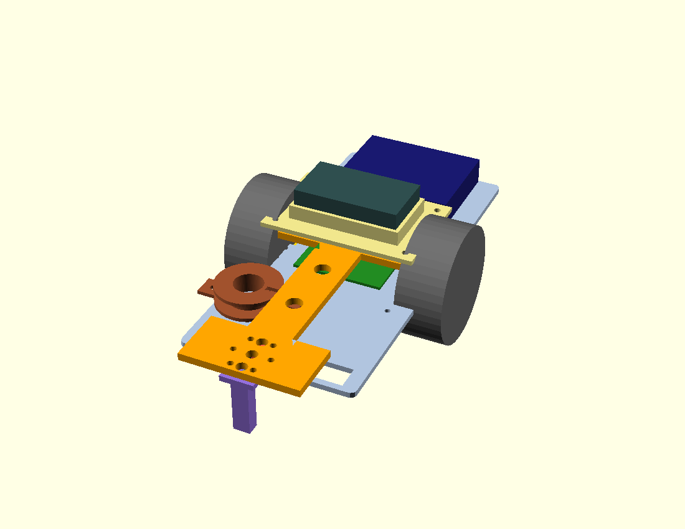
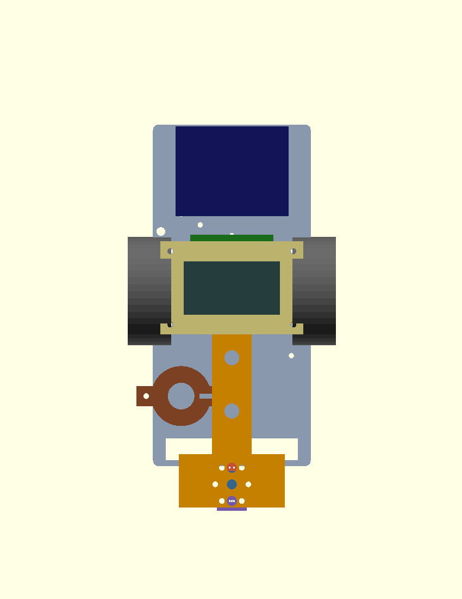

# Mechanical & sensor layout — rover design, 3D prints, and parts to order

This folder is the **mechanical/sensor design package**: where every sensor,
the battery and the boards sit on the rover, the 3D-printable mounts that hold
them, and **exactly what we need to order** (with supplier links and prices).

- 📐 Full design rationale + diagrams → **[`rover_layout.md`](rover_layout.md)**
- 🧾 Full bill of materials + ordering rules → **[`../hardware/BOM.md`](../hardware/BOM.md)**
- 🖨️ How to print the parts → **[`print/README.md`](print/README.md)**
- 🧱 Alternative **stacked-deck chassis** concept (two decks on pillars + coil ring) → **[`stacked_deck/`](stacked_deck/README.md)**

## The whole rover

| Isometric | Top-down (layout) |
|---|---|
|  |  |

*The chassis, wheels, battery and Metro are representative blocks; the boom,
sensor housings and battery tray are the actual printable parts. Open
`print/rover_assembly.scad` in OpenSCAD (press F5) to spin it around.*

## Design in brief

The EEEBug is a **centre-axle** rover (it pivots about the middle), so:

- **Sensors go on a front boom**, as far as possible from the motor magnets and
  PWM noise — the **Hall sensor** especially, on a long pod that reaches near the
  floor to read the magnet inside the rock.
- **IR, ultrasound and Hall** face **down** in a line at the boom tip; the rover
  noses up to a rock and scans it.
- **Radio antenna coil** sits low at the **front-left**, off the boom centre-line.
- **Battery (4×AA, ~100 g)** sits on a tray **over the axle** — balances the
  pivot, loads the wheels for traction, and keeps its noise away from the weak
  analogue front-ends.
- **Metro M0 + WiFi** stay at the **rear**.
- Estimated total mass **≈ 503 g** (limit 750 g); design spend **≈ £20–51**
  (budget ~£55). See the layout doc for the full weight budget and rationale.

## What's in here

| File | What it is |
|---|---|
| [`rover_layout.md`](rover_layout.md) | Master design doc: layout, physics rationale, weight budget, keep-out zones, hole mapping, assembly order |
| [`../hardware/BOM.md`](../hardware/BOM.md) | Full parts list with supplier order codes, prices, dimensions, ordering rules |
| [`print/`](print/README.md) | Parametric OpenSCAD parts (`.scad`), rendered `.stl`, preview `.png`, and `render.sh` |
| `print/rover_assembly.scad` | The whole-rover 3D model (visualisation) |
| `print/chassis.scad` | Exact EEEBug outline auto-generated from `chassis.svg` |
| `chassis.svg` / `.dxf` / `.pdf` | Original EEEBug V3.1 chassis CAD (laser-cut source) |
| [`CHASSIS_CAD.md`](CHASSIS_CAD.md) | Notes on the chassis CAD formats / laser-cut conventions |

Printable parts: `boom`, `ir_shroud`, `ultrasound_clamp`, `hall_pod`,
`antenna_bobbin`, `perfboard_carrier`, `battery_tray`. All print flat in PLA,
no supports; largest is the boom at 86 × 127 mm (well inside the 200 mm printer).

---

## 🛒 Parts to order

> **Orders go through the [EEE Stores order form](https://www.imperial.ac.uk/electrical-engineering/internal/stores/)** via our nominated approver.
> Allowed suppliers only (RS / OneCall = Farnell & CPC / Rapid / EED Stores).
>
> ⚠️ **Prices are estimates** — the supplier pages block automated price
> reads, so **click the link and confirm the live price on the order form
> before ordering.** Order codes and dimensions are datasheet/catalogue-verified.
>
> 🚫 Per the brief: **do not order batteries, glue/chemicals, or tools.** The AA
> cells, magnet, Metro, WiFi shield, motor driver and breadboard are in the kit.
> Everything below is **through-hole** (no surface-mount).

### Group A — specialist sensor parts (order from RS / Farnell / CPC)

| Part | For | Supplier · code | Qty | Unit (est) | Line (est) |
|---|---|---|---|---|---|
| Murata **MA40S4R** 40 kHz Rx | ultrasound | [CPC SN36522](https://cpc.farnell.com/murata/ma40s4r/sensor-ultrasonic-0-2-4m-rx/dp/SN36522) | 2 | £2.50 | £5.00 |
| Honeywell **SS49E** Hall | magnetic | [RS 236-2760](https://uk.rs-online.com/web/p/hall-effect-sensors/2362760) | 2 | £1.50 | £3.00 |
| OSRAM **SFH 300** phototransistor | infrared | [Farnell 2981724](https://uk.farnell.com/osram-opto-semiconductors/sfh-300/photo-trans-npn-880nm-radial-leaded/dp/2981724) | 2 | £0.60 | £1.20 |
| Microchip **MCP6292-E/P** dual op-amp (DIP-8) | IR/radio/US amps | [Farnell 1439466](https://uk.farnell.com/microchip/mcp6292-e-p/op-amp-10mhz-dual-pdip8-6292/dp/1439466) | 3 | £1.00 | £3.00 |
| Roth **RE016-LF** perfboard (68.6×68 mm) | large board | [RS 897-1402](https://uk.rs-online.com/web/p/matrix-boards/8971402) | 1 | £3.39 | £3.39 |
| Roth **RE015-LF** perfboard (40.5×40 mm) | small boards | [RS 897-1408](https://uk.rs-online.com/web/p/matrix-boards/8971408) | 2 | £1.63 | £3.26 |
| | | | | **Subtotal A** | **≈ £18.85** |

### Group B — commodity parts (try EED Stores dept stock first, else order)

| Part | For | Supplier · code | Qty | Unit (est) | Line (est) |
|---|---|---|---|---|---|
| M3 nylon hex standoff, M-F, 15 mm (pk 100) | mount boom/tray | [Rapid 52-4352](https://www.rapidonline.com/r-tech-524352-nylon-hexagonal-m3-m-f-spacers-15mm-pack-of-100-52-4352) | 1 | £7.63 | £7.63 |
| M3 steel pan screw, 6 mm (pk 100) | board/module screws | [Rapid 33-7089](https://www.rapidonline.com/r-tech-337089-pozi-pan-head-a2-stainless-steel-screws-m3-6mm-pack-of-100-33-7089) | 1 | £4.59 | £4.59 |
| M3 steel hex nut (pk 100) | lock standoffs | [Rapid 33-7173](https://www.rapidonline.com/r-tech-337173-a2-stainless-steel-hex-nut-m3-pack-of-100-33-7173) | 1 | £3.89 | £3.89 |
| Enamelled copper wire 0.28 mm (solderable) | 89 kHz antenna coil | [RS 779-0700](https://uk.rs-online.com/web/p/copper-wire/7790700) | 1 | £8–12 | £10.00 |
| 0.1″ pin headers + M-M jumper leads | inter-board wiring | CPC / dept stock | – | £3.00 | £3.00 |
| Resistors + capacitors (IR/radio/US front-ends) | front-ends | dept stock / kit | – | £3.00 | £3.00 |
| | | | | **Subtotal B** | **≈ £32.11** |

**Budget:** ≈ **£51 if everything is ordered**, or **≈ £20–25** if Group B comes
from EED Stores dept stock — both inside the ~£55 left. See
[`../hardware/BOM.md`](../hardware/BOM.md) for spare quantities, the SS495A (5 V)
Hall alternative, and the full ordering-rules checklist.

---

## See / build it

- **3D model:** open `print/rover_assembly.scad` in [OpenSCAD](https://openscad.org) → press **F5** (drag to rotate). Or just look at the PNGs in `print/preview/`.
- **Print:** `cd mech/print && ./render.sh` regenerates all STLs; print PLA, 0.2 mm layers, 4 perimeters, 25 % infill, no supports.
- **Edit a dimension:** every part is parametric — change the variable at the top of the relevant `.scad` (e.g. battery-pocket size in `battery_tray.scad`).

*Questions on this design → ask in the group chat or open an issue.*
