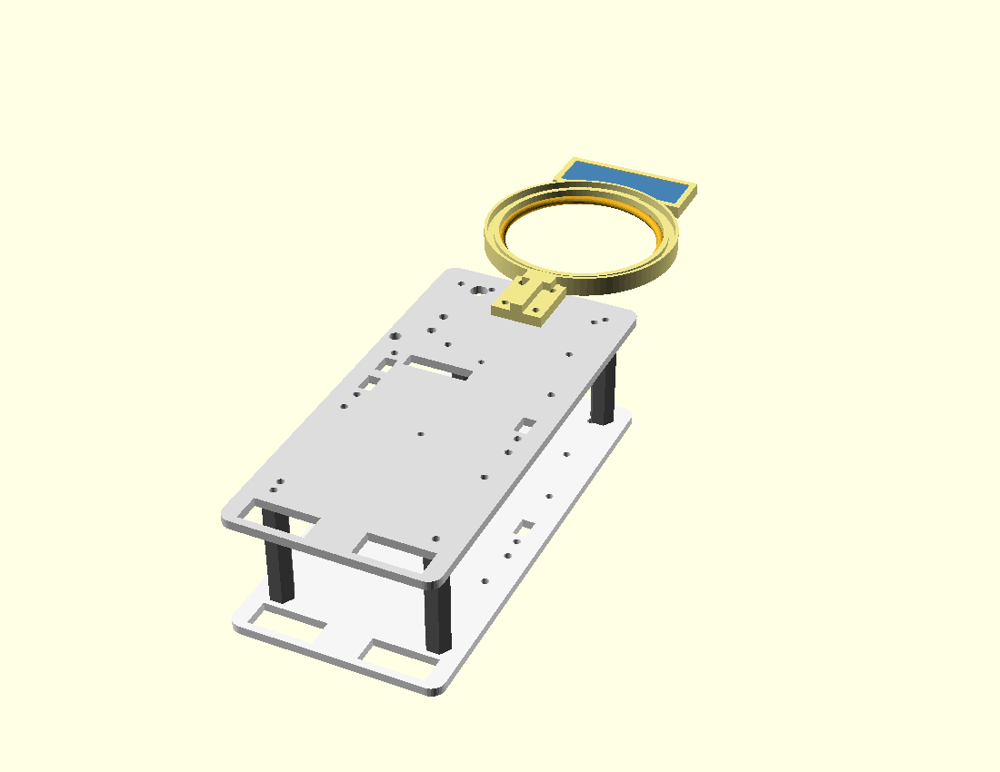
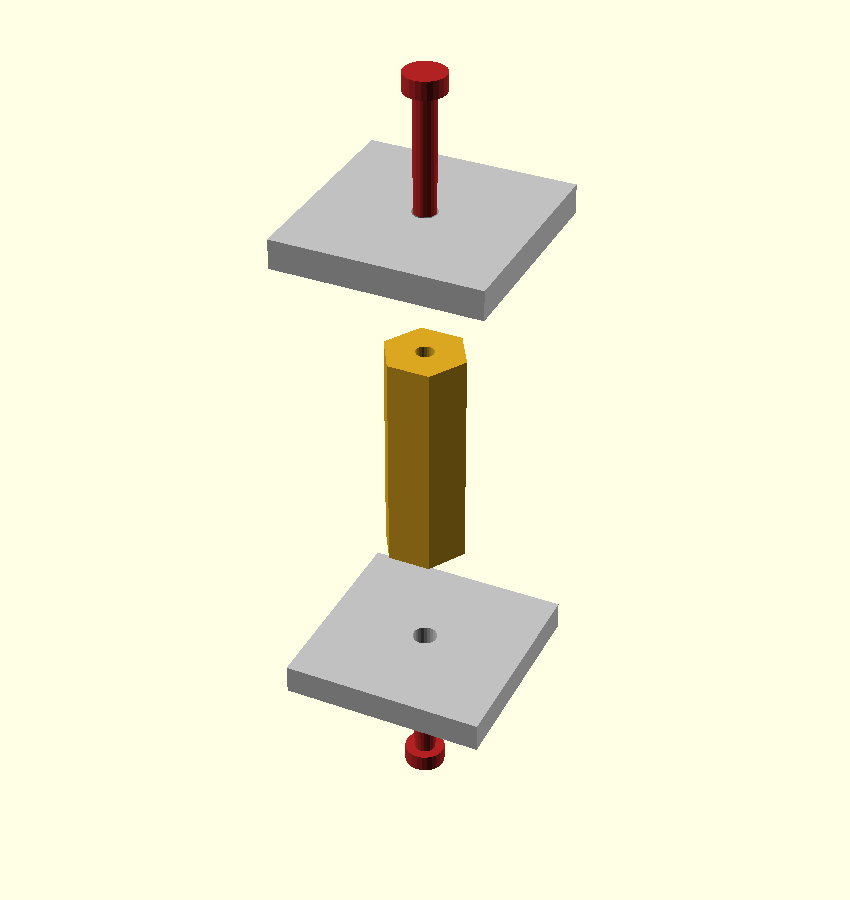
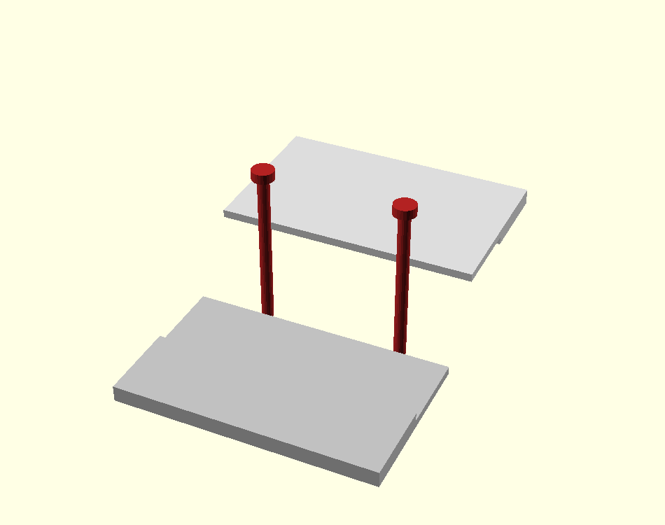

# Stacked-deck chassis + coil support

An alternative chassis concept (inspired by the reference rover): **two
rectangular decks with the board's hole pattern, stacked on 4 corner pillars**,
plus a **braced coil ring + sensor tray** that screws onto a deck.

## One STL per component

| STL | Print qty | Size | Notes |
|---|---|---|---|
| `stl/deck_half_A.stl` | ×2 | ~122 × 95 mm | front half + bottom overlap ledge (motor slots) |
| `stl/deck_half_B.stl` | ×2 | ~102 × 95 mm | rear half + top overlap ledge (**print upside-down**) |
| `stl/pillar.stl` | ×4 | Ø10 × 50 mm | corner stacking pillar (~5 cm deck gap) |
| `stl/coil_support.stl` | ×1 | ~127 × 91 mm | braced ring (coil) + perfboard tray |
| `stl/deck_full.stl` | — | 204 × 95 mm | **reference/viewing only — too long to print whole** |

A full deck is **204 mm**, longer than the 200 mm printer, so each deck prints
as **half A + half B** (both inside the ~15–18 cm target) that **overlap** at a
half-lap and bolt together. Two identical decks → **either board can be on top**.

## How the parts connect

| Pillar ↔ decks | Half A ↔ half B |
|---|---|
|  |  |
| A short M3 screw through each deck's corner hole self-taps into the pillar end. | The two halves **overlap** (half-lap) and 2 M3 screws clamp them into one flush deck — no extra part. |

## How it goes together

1. Overlap `deck_half_A` (front) and `deck_half_B` (rear) at the half-lap and
   clamp with 2 M3 screws (+ nuts) → one flush deck. Do it twice.
2. Stand the **4 pillars** between the decks at the corner holes. Drive a short
   **M3 × 8–10 mm screw through each deck's corner hole into the pillar end** —
   it self-taps into the pillar's Ø2.5 pilot and clamps the deck. (Sturdier
   option: one M3 threaded rod through deck+pillar+deck with a nut each end —
   set `HOLE = M3_CLEAR` in `pillar.scad`.)
3. Screw the **coil support** onto a deck's 4 coil-mount holes (4× M3). The coil
   (~75 mm) drops into the ring and is held by the lip; the **braced rim** stops
   the arm drooping.
4. Mount your **60 × 20 mm perfboard** (ultrasound + phototransistor) in the
   tray; the sensors face **down** through the slot.

## Key parameters (all at the top of each `.scad`)

| What | Value | File |
|---|---|---|
| Coil diameter | 75 mm (set yours: 70–75) | `coil_support.scad` `COIL_D` |
| Deck spacing (pillar height) | 50 mm (~5 cm) | `pillar.scad` `PILLAR_H` |
| Brace height | 9 mm | `coil_support.scad` `H_BRACE` |
| Deck thickness | 4 mm | `deck.scad` `DECK_T` |
| Coil support on which deck | upper (sensors up top) | `stack_assembly.scad` `sup_z` |

## Notes / honest flags
- **Sensors are on the top deck** (as requested) — ~50 mm higher off the ground,
  so the down-facing sensors have a bigger gap to the rock. Drop `sup_z` to the
  lower deck if scanning range matters more than the top mount.
- **Weight:** two 4 mm PLA decks + pillars + support ≈ **120–140 g**. If the
  750 g limit gets tight, thin the decks to 3 mm or add lightening cut-outs.
- **Cantilever:** the support reaches ~110 mm past the deck edge. The brace
  handles droop; for extra security add a small skid leg under the tray tip.

## View it
Open `stack_assembly.scad` in OpenSCAD → **F5** (drag to rotate), or see
`preview/stack_iso.png`. Re-render all STLs from the `.scad` files with OpenSCAD.
